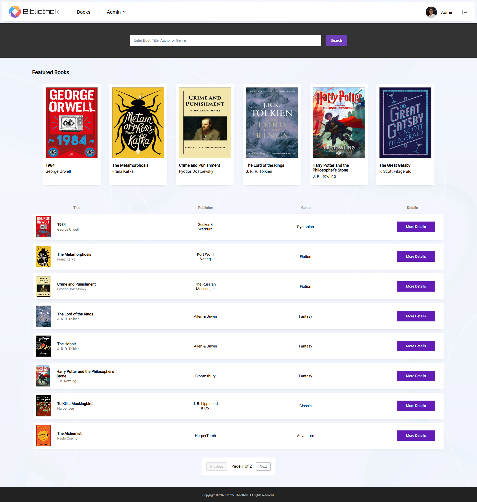

# Bibliothek - Library Management System


Bibliothek is a **Fullstack Monolith** designed for managing public school libraries. It provides **structured loan control**, **Role-Based Access Control (RBAC)**, and **Internationalization**, with an emphasis on clean code and type safety.

<div align="center">
  
</div>

> **Note:** Originally developed for public schools in Blumenau (Brazil), this project was later refactored with a fully English codebase, strict typing, and production-oriented architectural patterns.

---

## 🏗 Architecture & Design

### Backend (Spring Boot 3.4)
*   **Layered Architecture:** Strict separation of concerns (Controllers, Domain Services, Infrastructure).
*   **Security:** Implements **Spring Security** with stateless **JWT Authentication**.
*   **Data Integrity:** Uses `@Transactional` and `@Lock` to ensure atomicity during complex loan operations (stock checks + user validation + loan creation).
*   **Persistence:** PostgreSQL managed via **Flyway** migrations for consistent schema evolution.

### Frontend (Angular 16)
*   **Enterprise Forms:** Utilizes **Reactive Forms** for robust validation and error handling.
*   **Internationalization (i18n):** Full multi-language support (EN/PT) using **ngx-translate**.
*   **Component Composition:** Implements "Smart vs. Dumb" component patterns.
*   **UX Patterns:** Includes Optimistic UI updates, Toast notifications, and Loading Spinners.

---

## ✨ Core Features

- User authentication with role-based access control (Admin / Student)
- Book catalog management with stock tracking
- Loan lifecycle management with transactional and lock safety
- Internationalized UI (English / Portuguese)
- Featured highlights and genre-based recommendations

---

## 🚀 Getting Started

The entire application is containerized using Docker Compose.

### Prerequisites
*   Docker & Docker Compose

### 1. Start the Stack
```bash
# Clone the repository
git clone https://github.com/William-Nogueira/bibliothek.git

# Start Backend (Spring), Database (Postgres), and Frontend (Angular)
docker-compose up --build
```

### 2. Access the Application
*   **Web Interface:** `http://localhost:4200`
*   **API Endpoints:** `http://localhost:8080/api`

### 3. Login Credentials
The database comes pre-seeded with these accounts:

| Role        | Registration ID | Password |
|:------------|:----------------|:---------|
| **Admin**   | `admin`         | `admin`  |
| **Student** | `12345`         | `12345`  |

---

## 📄 License

This project is licensed under the MIT License - see the [LICENSE](LICENSE) file for details.
